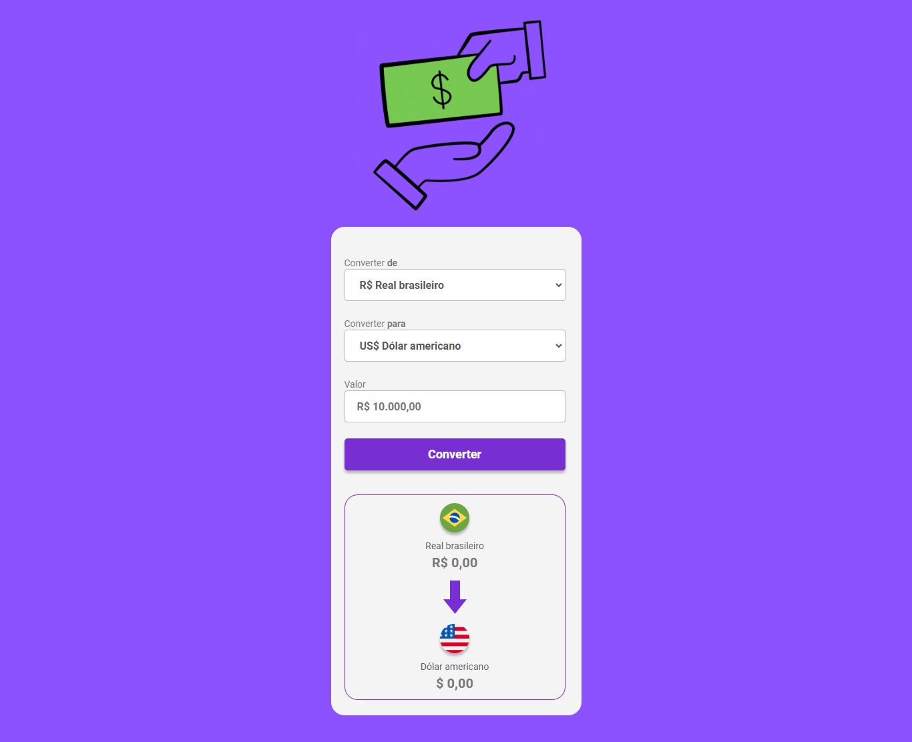

# Convert money 💰

>DevClub

Projeto proposto na plataforma DevClub para treino de JavaScript e lógica de programação. A aplicação permite converter qualquer valor do real brasileiro para o dólar americano, euro ou bitcoin, obtendo informações em tempo real, devido à sua integração com API.

🔗 [Clique aqui para acessar](https://alineguiseline.github.io/convert-money/)

## Tecnologias utilizadas
- HTML  
- CSS  
- JavaScript
- API

## Contato 💜
[LinkedIn](https://www.linkedin.com/in/alineguiseline)